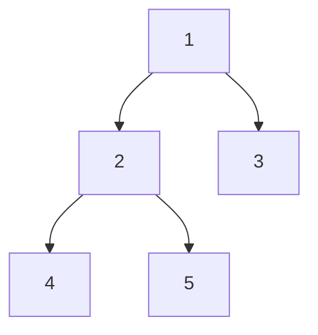

# [543. Diameter of Binary Tree](https://leetcode.com/problems/diameter-of-binary-tree/)

## question

Given a binary tree, you need to compute the length of the diameter of the tree. The diameter of a binary tree is the length of the longest path between any two nodes in a tree. This path may or may not pass through the root. 

**Example :**
Given a binary tree 

 Return **3**, which is the length of the path [4,2,1,3] or [5,2,1,3].

**Note:** The length of path between two nodes is represented by the number of edges between them. 

## think
- 要用 recursive （遞迴）的方式來處理
- 如果該父節點的 左&右子節點都是 不架在的話，就可以回傳那一個 level 的 depth 是 1
- 